## Table of Contents

- [Project Overview](#project-overview)
  - [Tech Stack](#tech-stack)
- [Repository Structure](#repository-structure)
- [Architecture Diagram](#architecture-diagram)
  - [Scope 1 - Bootstrap](#scope-1---bootstrap)
  - [Scope 2a - Infrastructure & Networking](#scope-2a---infrastructure--networking)
  - [Scope 2b - Runtime Architecture](#scope-2b---runtime-architecture)
  - [Scope 3 - Security-Build Pipeline (CI)](#scope-3---security-build-pipeline-ci)
- [Reproduction Instructions](#reproduction-instructions)
  - [Cloud Set-Up](#cloud-set-up)
  - [Local Set-Up](#local-set-up)
- [Screenshots](#screenshots)
- [Security](#security)
- [Challenges](#challenges)

## Project Overview
This project focuses on deploying a fully containerised 'Memos' notes application on AWS EKS (Elastic Kubernetes Service).
The infrastructure is provisioned using Terraform for consistency and scalability.
CI/CD pipelines have been implemented using GitHub Actions to automate the deployment process, and monitoring tools like Prometheus and Grafana are configured to provide real-time insights into application performance and infrastructure health.

### Tech Stack


| Category | Technology | Role |
|---|---|---|
| Infrastructure as Code | Terraform + Terragrunt | Provisions all AWS infrastructure as DRY, reusable modules with S3 remote state |
| CI/CD | GitHub Actions | Runs the pipelines: security scans, image build and push, and cluster provisioning |
| Orchestration | Kubernetes (Amazon EKS) | Runs and schedules the containerised workloads |
| Containerisation | Docker | Packages the memos app into a consistent runtime image |
| Packaging | Helm | Ships the app and platform add-ons as versioned, configurable releases |
| GitOps | ArgoCD | Declaratively syncs the cluster to git and self-heals drift |
| Ingress | NGINX Ingress Controller | Routes external HTTPS traffic to the right in-cluster services |
| TLS | cert-manager | Issues and renews Let's Encrypt certificates automatically |
| DNS | ExternalDNS | Keeps Route 53 records in sync with cluster ingresses |
| Metrics | Prometheus | Collects and queries app and infrastructure metrics |
| Dashboards | Grafana | Visualises those metrics through custom dashboards |
| Database | Amazon RDS (PostgreSQL) | Durable, encrypted, private database for the app's notes |
| Secrets | External Secrets Operator | Syncs DB credentials from AWS Secrets Manager into the cluster, nothing in git |
| Continuous delivery | ArgoCD Image Updater | Detects new images in ECR and rolls them out with no git commit |

## Repository Structure
```
.
├─ Dockerfile                          # multi-stage build for the memos image
├─ .dockerignore
├─ .gitignore
├─ .gitmodules                         # pins the memos submodule
├─ .trivyignore                        # upstream CVEs waived in the Trivy image scan
├─ .pre-commit-config.yaml             # local pre-commit hooks: gitleaks secret scan, terraform fmt, hygiene
├─ setup.sh                            # one-command port: rewrites the 4 values + sets GitHub Actions vars via gh
├─ README.md
├─ app/
│  └─ memos/                           # app source (git submodule → usememos/memos)
│
├─ Terraform/
│  ├─ root.hcl                         # Terragrunt root: AWS provider, S3 remote state (use_lockfile), shared locals (region/account/domain/repo)
│  │
│  ├─ bootstrap/                       # Scope 1: applied LOCALLY (foundational state)
│  │  ├─ main.tf                       # state bucket (versioned/encrypted), Route53 zone, ECR + lifecycle, GitHub OIDC provider + CI IAM role
│  │  ├─ provider.tf
│  │  ├─ variables.tf
│  │  ├─ locals.tf
│  │  ├─ outputs.tf
│  │  ├─ terraform.tfvars              # the 4 portable values (account, region, domain, repo)
│  │  ├─ terragrunt.hcl
│  │  ├─ backend.tf.disabled           # S3 backend; renamed to backend.tf after first apply, then state is migrated
│  │  └─ github-tight-policy.json.tftpl  # least-privilege IAM policy for the CI role, rendered via templatefile()
│  │
│  └─ infra/                           # Scope 2: applied by CI (cluster + addons)
│     ├─ live/                         # Terragrunt units: thin wrappers wiring modules + dependencies
│     │  ├─ vpc/terragrunt.hcl
│     │  ├─ eks/terragrunt.hcl
│     │  ├─ rds/terragrunt.hcl
│     │  └─ eks-addons/terragrunt.hcl
│     └─ modules/                      # reusable Terraform modules
│        ├─ vpc/                       # VPC, public + private subnets, IGW, NAT gateway + EIP, route tables
│        ├─ eks/                       # EKS cluster, managed node group, cluster/node IAM roles, IRSA OIDC provider, access entries
│        ├─ rds/                       # RDS PostgreSQL, customer-managed KMS key, DB subnet group + security group
│        └─ eks-addons/               # Helm releases: cert-manager, ExternalDNS, ArgoCD (+ Image Updater), External Secrets Operator, kube-prometheus-stack (+ IRSA roles)
│           └─ helm-values/           # values files: cert-manager, external-dns, external-secrets, argocd-image-updater
│
├─ helm/
│  └─ memos-chart/                     # the app's Helm chart (deployed by ArgoCD, not by CI)
│     ├─ Chart.yaml
│     ├─ values.yaml                   # image repo/tag (updated in-cluster by ArgoCD Image Updater), ingress host, database (RDS) settings
│     └─ templates/                    # Deployment, Service, Ingress, ExternalSecret (+ SecretStore)
│
├─ manifests/                          # cluster-applied YAML (kubectl apply steps in cluster.yaml)
│  ├─ memos-application.yaml                 # ArgoCD Application → reconciles helm/memos-chart from git
│  ├─ clusterIssuer-staging.yaml       # cert-manager Let's Encrypt staging issuer (DNS-01 via Route53)
│  ├─ clusterIssuer-prod.yaml          # cert-manager Let's Encrypt production issuer
│  └─ nginx-servicemonitor.yaml        # ServiceMonitor scraping nginx :9113 metrics into Prometheus
│
├─ monitoring/
│  └─ dashboards/
│     └─ nginx-ingress.json            # Grafana dashboard, auto-provisioned via labeled ConfigMap (sidecar)
│
└─ .github/workflows/
   ├─ cluster.yaml                     # Pipeline 1: terragrunt provision → install nginx, issuers, ArgoCD app, dashboards
   ├─ security-build.yaml              # Pipeline 2: Checkov → build/push image to ECR → Trivy (ArgoCD Image Updater deploys it)
   ├─ pre-commit.yaml                  # runs the pre-commit hooks (gitleaks, fmt) on every PR
   └─ destroy.yaml                     # terragrunt destroy (dispatch)
```

## Architecture Diagram
The project is delivered in four scopes; each diagram below shows one.

### Scope 1 - Bootstrap

Foundational state applied **locally**: the versioned/encrypted S3 state bucket, the Route 53 hosted zone, ECR, and the GitHub OIDC provider + CI IAM role that every later pipeline assumes.

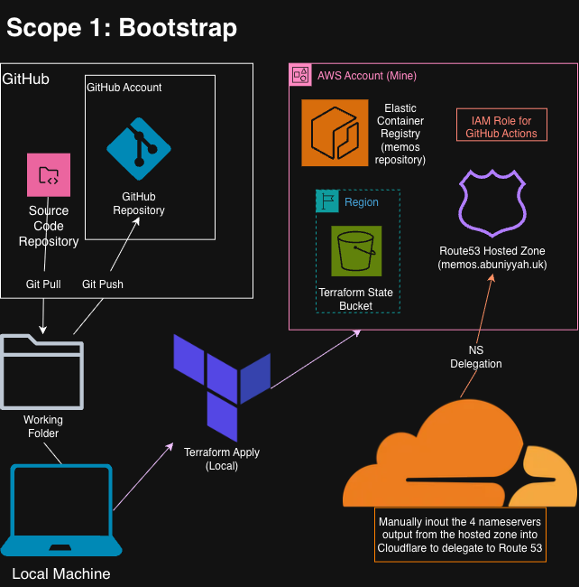

### Scope 2a - Infrastructure & Networking

The VPC layer provisioned by CI: public/private subnets across AZs, IGW, NAT gateway, the AWS-managed EKS control plane + ENIs, the managed node group, and the auto-created load-balancer / cluster security groups. This layer also holds the RDS PostgreSQL database (in the private subnets, encrypted with a customer-managed KMS key, TLS enforced), with its master credentials stored in AWS Secrets Manager.

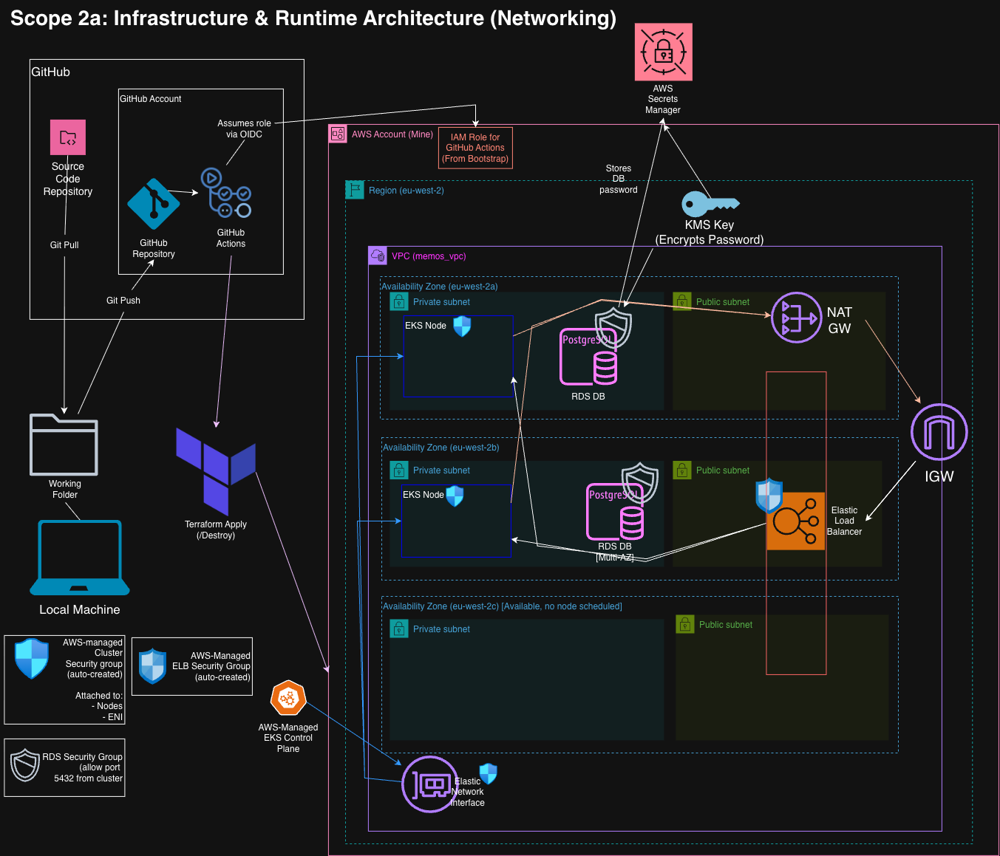

### Scope 2b - Runtime Architecture

What runs **inside** the cluster: ArgoCD (GitOps) and ArgoCD Image Updater, the memos Deployment/Service, the NGINX ingress controller, cert-manager TLS (`memos-tls`), ExternalDNS → Route 53, and the Prometheus/Grafana monitoring stack. External Secrets Operator syncs the database credentials from AWS Secrets Manager into a `memos-db` secret the app reads, and the memos pods connect out to the RDS PostgreSQL database (Scope 2a) over TLS.

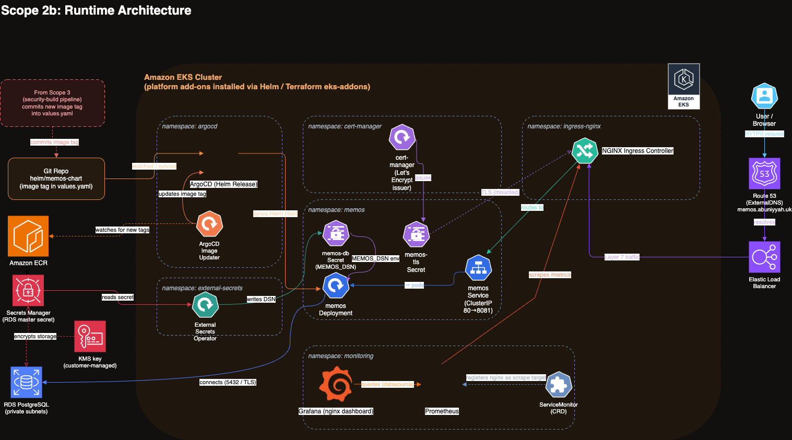

### Scope 3 - Security-Build Pipeline (CI)

The `security-build.yaml` pipeline: OIDC keyless auth, Checkov IaC scan, image build + push to ECR, ECR + Trivy CVE scans (Trivy **gates** the build). The pipeline stops there. ArgoCD Image Updater (Scope 2b) detects the new image in ECR and rolls it out, so nothing is ever committed to the protected branch.

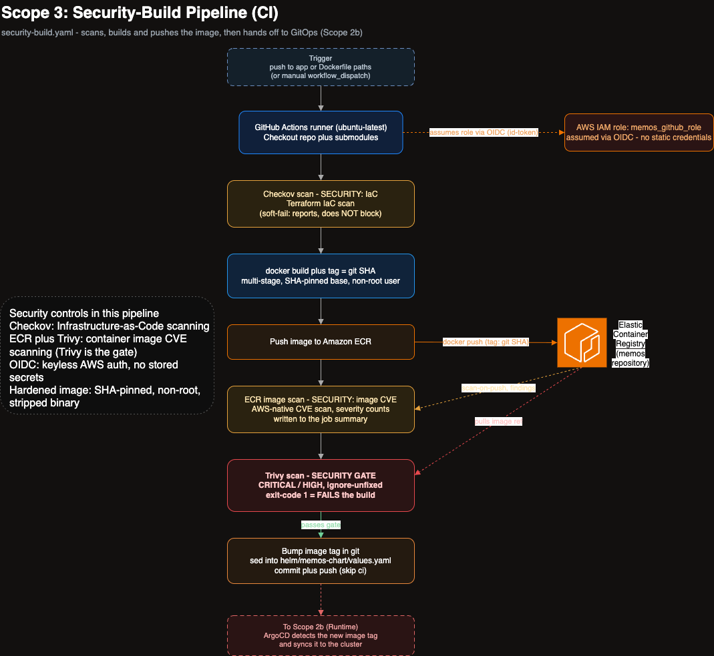

## Reproduction Instructions

### Cloud Set-Up

Deploys the full stack to AWS EKS. **Bootstrap** is applied locally with Terraform; everything after it runs through GitHub Actions.

**Prerequisites**

- An AWS account, with the AWS CLI installed and configured locally.
- A domain you own (via any registrar, e.g. Cloudflare).
- `terraform` and `gh` (GitHub CLI) installed locally.
- A fork of this repository.

**1. Configure the AWS CLI**

Create an IAM user (AWS Console → IAM → Users → Create User) with sufficient permissions, then under its Security Credentials tab create an access key. Run `aws configure` and enter:

- AWS Access Key ID / Secret Access Key: from the IAM user
- Default region: e.g. `eu-west-2`
- Default output format: `json`

**2. Fork and clone**

Fork the repo (Fork button, top-right), then clone your fork with submodules and refresh the app submodule:

```bash
git clone --recurse-submodules <your-fork-url>
cd <your-fork>
git submodule update --remote app/memos   # pull latest memos app code
gh auth login                              # install gh via your package manager if needed
```

**3. Port the project to your values**

```bash
./setup.sh
```

Enter your account ID, region, domain, and `owner/repo` when prompted. This rewrites those values across the repo, fetches your GitHub owner/repo numeric IDs (for the immutable OIDC subject) into `terraform.tfvars`, and sets the required GitHub Actions variables (`AWS_ACCOUNT_ID`, `AWS_REGION`, `ECR_REPO`, `APP_DOMAIN`).

**4. Bootstrap (local Terraform)**

Creates the S3 state bucket, Route 53 hosted zone, ECR, and the GitHub OIDC provider + CI IAM role. It starts on local state, then migrates into the bucket it just created:

```bash
cd Terraform/bootstrap
terraform init
terraform apply -auto-approve
mv backend.tf.disabled backend.tf
terraform init -migrate-state -force-copy
terraform apply -auto-approve
cd ../..
```

**5. Delegate DNS (manual)**

The bootstrap output lists 4 Route 53 nameservers. Add them as NS records at your domain registrar for the domain (or subdomain) you own. This hands DNS authority to Route 53. TLS certificate issuance will not succeed until this is done.

**6. Run the pipelines**

Because this is a fork, enable workflows in your repo's **Actions** tab. Then run them in order:

1. **`cluster.yaml`**: provisions the VPC + EKS cluster (Terragrunt) and installs NGINX ingress, cert-manager issuers, the ArgoCD Application, and the Grafana dashboards.
2. **`security-build.yaml`**: builds your image, scans it (Checkov + Trivy), and pushes it to ECR. ArgoCD Image Updater then detects the new image and rolls it out (no git commit).

From the terminal:

```bash
gh repo set-default <your-fork>
gh workflow run cluster.yaml
gh workflow run security-build.yaml
```

Monitor with:

```bash
gh run list          # recent runs + their status
gh run watch         # live-follow the latest run until it finishes
gh run view --log    # full logs of a run
```

> Until `security-build.yaml` has pushed your fork's image to ECR, the app pods sit in `ImagePullBackOff`, since the placeholder tag points at an image that isn't there yet. ArgoCD Image Updater rolls them out once the image lands (within a couple of minutes of the push). cert-manager certificate validation can also take several minutes.

**Point the app at the database** (once `cluster.yaml` has provisioned RDS)

`cluster.yaml` stands up the RDS database as part of the infrastructure. Read its outputs and put them in the chart so the app can connect:

```bash
cd Terraform/infra/live/rds && terragrunt output
```

Set `database.host` to the `db_address` value and `database.awsSecretName` to the `master_user_secret_arn` value in `helm/memos-chart/values.yaml`, then commit and push. External Secrets Operator builds the connection string from the Secrets Manager secret, and ArgoCD rolls out the app pointed at Postgres. (Leave `database.enabled: true`; set it to `false` only for the local SQLite path.)

**7. Verify**

- App: `https://<your-domain>` (health check at `https://<your-domain>/healthz`)
- Grafana: `https://grafana.<your-domain>`

The certificate is trusted by default (production issuer). If you switched to `letsencrypt-staging` to iterate, the browser will warn it's untrusted. Switch back to `letsencrypt-dns01`, push, then `kubectl delete secret memos-tls -n memos` to force re-issuance.

**8. Access the cluster (optional, to inspect the runtime)**

The site works without this, but connecting with `kubectl` lets you inspect the running cluster (pods, the ArgoCD Application, cert-manager `Certificate`s, Grafana). The cluster uses API-only authentication and was created by the **CI role**, so your local IAM identity starts with **no access**, so grant it an access entry, then connect:

```bash
CLUSTER=memos-eks-cluster
REGION=eu-west-2
MY_ARN=$(aws sts get-caller-identity --query Arn --output text)

aws eks create-access-entry --cluster-name "$CLUSTER" --region "$REGION" --principal-arn "$MY_ARN"
aws eks associate-access-policy --cluster-name "$CLUSTER" --region "$REGION" \
  --principal-arn "$MY_ARN" \
  --policy-arn arn:aws:eks::aws:cluster-access-policy/AmazonEKSClusterAdminPolicy \
  --access-scope type=cluster

aws eks update-kubeconfig --name "$CLUSTER" --region "$REGION"
kubectl get pods -A
```

(Declarative alternative: add an `aws_eks_access_entry` + `aws_eks_access_policy_association` for your ARN in `Terraform/infra/modules/eks/eks.tf`, mirroring the `github_role` block, then re-run `cluster.yaml`.)

**9. Destroy**

Take the app and cluster offline:

```bash
gh workflow run destroy.yaml
gh run watch
```

To also remove the foundation (state bucket, zone, ECR, IAM), tear down bootstrap locally, migrating its state back off S3 first, since the bucket itself is about to be deleted:

```bash
cd Terraform/bootstrap
mv backend.tf backend.tf.disabled
terraform init -migrate-state -force-copy
terraform destroy -auto-approve
cd ../..
```

Finally, remove the 4 NS records from your domain registrar.

### Local Set-Up

Runs the full stack on a local [kind](https://kind.sigs.k8s.io/) cluster, running the same in-cluster components as the cloud path, minus the three pieces that require real AWS/DNS:

- **ExternalDNS → `/etc/hosts`** (no Route 53 locally).
- **Let's Encrypt → a self-signed cert-manager issuer** (no public domain locally). The issuer reuses the name `letsencrypt-staging` so the chart's hardcoded Ingress annotation resolves unchanged, so no chart edit is needed.
- **ArgoCD → a direct `helm install`** (no GitOps sync from a remote repo).

**Prerequisites:** the Docker daemon running, plus `kind`, `helm`, and `kubectl` installed.

**1. Cluster + image**

```bash
kind create cluster
docker build -t memos:local .
kind load docker-image memos:local
```

**2. cert-manager + a local self-signed issuer**

```bash
helm repo add jetstack https://charts.jetstack.io
helm repo update
helm upgrade --install cert-manager jetstack/cert-manager \
  --namespace cert-manager --create-namespace \
  --set crds.enabled=true
kubectl -n cert-manager rollout status deploy/cert-manager-webhook

# Named to match the chart's Ingress annotation (cert-manager.io/cluster-issuer: letsencrypt-staging)
kubectl apply -f - <<'EOF'
apiVersion: cert-manager.io/v1
kind: ClusterIssuer
metadata:
  name: letsencrypt-staging
spec:
  selfSigned: {}
EOF
```

**3. Monitoring stack (Prometheus + Grafana)**

```bash
helm repo add prometheus-community https://prometheus-community.github.io/helm-charts
helm repo update
helm upgrade --install kube-prometheus-stack prometheus-community/kube-prometheus-stack \
  --namespace monitoring --create-namespace
```

**4. NGINX ingress**

```bash
helm repo add nginx-stable https://helm.nginx.com/stable
helm repo update
helm upgrade --install nginx-ingress-controller nginx-stable/nginx-ingress \
  --namespace nginx-ingress --create-namespace \
  --set prometheus.create=true --set prometheus.service.create=true \
  --skip-schema-validation
```

**5. The app + its monitoring wiring**

```bash
helm install memos ./helm/memos-chart \
  --set image.repository=memos --set image.tag=local \
  --set ingress.clusterIssuer=letsencrypt-staging \
  --set database.enabled=false   # use the app's built-in SQLite locally (no RDS / External Secrets)

kubectl apply -f manifests/nginx-servicemonitor.yaml
kubectl create configmap nginx-ingress-dashboard \
  --from-file=nginx-ingress.json=monitoring/dashboards/nginx-ingress.json \
  -n monitoring --dry-run=client -o yaml | kubectl apply -f -
kubectl label configmap nginx-ingress-dashboard -n monitoring \
  grafana_dashboard=1 --overwrite
```

**6. Reach the app**

The chart's Ingress uses host `memos.abuniyyah.uk` (or your domain, if you've run `setup.sh`), so point that at localhost and forward the ingress controller:

```bash
echo "127.0.0.1 memos.abuniyyah.uk" | sudo tee -a /etc/hosts

# The service name can vary; confirm with: kubectl get svc -n nginx-ingress
kubectl port-forward -n nginx-ingress \
  svc/nginx-ingress-controller-nginx-ingress 8443:443
```

Then visit <https://memos.abuniyyah.uk:8443>, and accept the self-signed cert (health check at `/healthz`). For Grafana:

```bash
kubectl port-forward -n monitoring svc/kube-prometheus-stack-grafana 3000:80
```

then <http://localhost:3000> (default login `admin` / `prom-operator`).

## Screenshots

Evidence from a live end-to-end deployment: the CI/CD pipelines, the AWS infrastructure, the in-cluster runtime, and the running app. Expand each section.

<details>
<summary><b>CI/CD pipelines (GitHub Actions)</b></summary>

**`security-build.yaml`: build, scan (Checkov + Trivy), push to ECR**

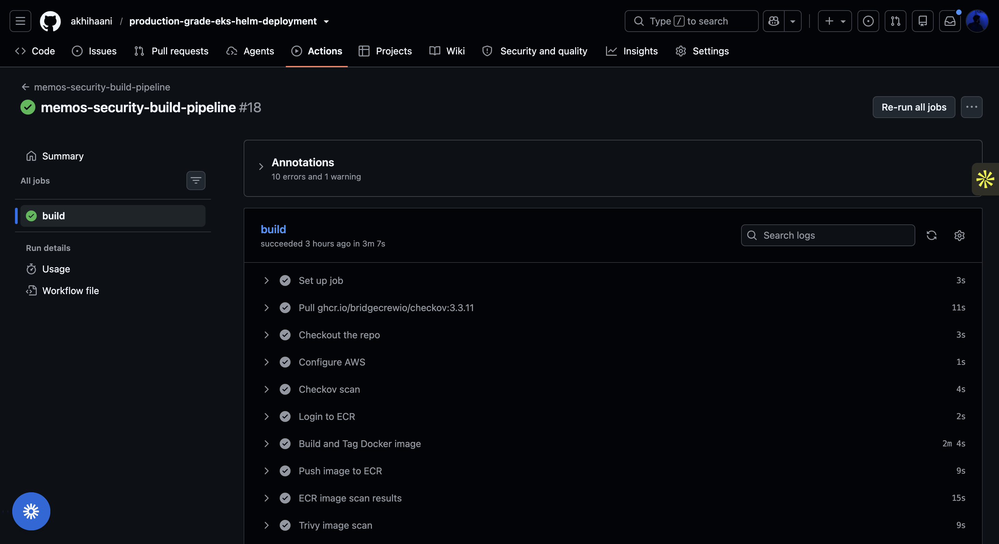

**`cluster.yaml`: provision (Terragrunt) + install add-ons**

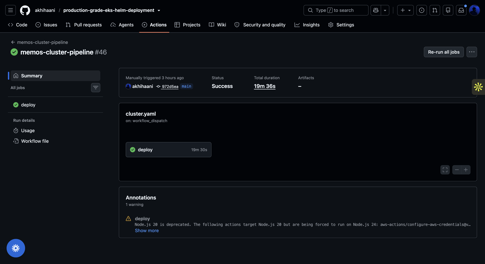

**`destroy.yaml`: teardown**

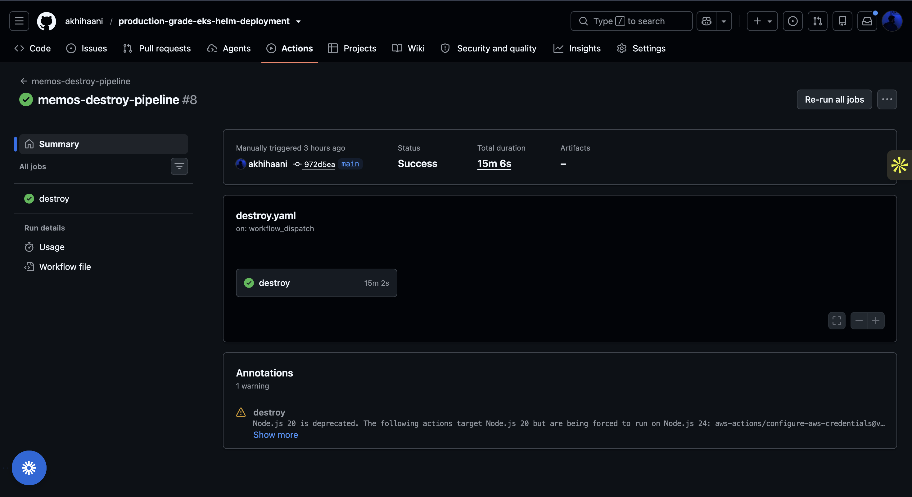

</details>

<details>
<summary><b>AWS infrastructure (console)</b></summary>

**VPC**

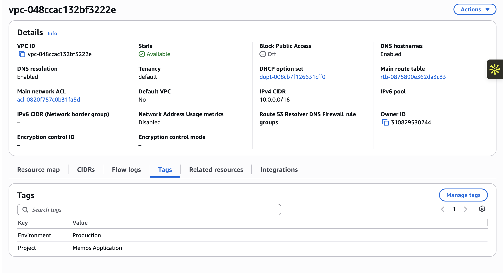

**Subnets (public + private across AZs)**

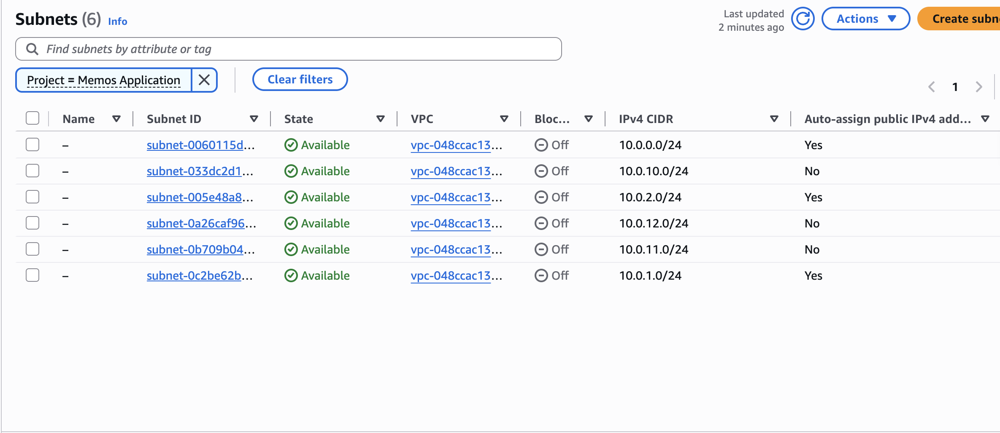

**Internet Gateway**

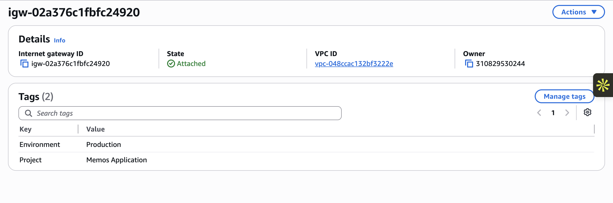

**NAT Gateway**


**Ingress load balancer**


**EKS cluster**


**ECR repository**


**Route 53 hosted zone + records**


</details>

<details>
<summary><b>Kubernetes runtime</b></summary>

**Running pods (`kubectl get pods -A`)**


**ArgoCD: `memos` Application Synced &amp; Healthy**

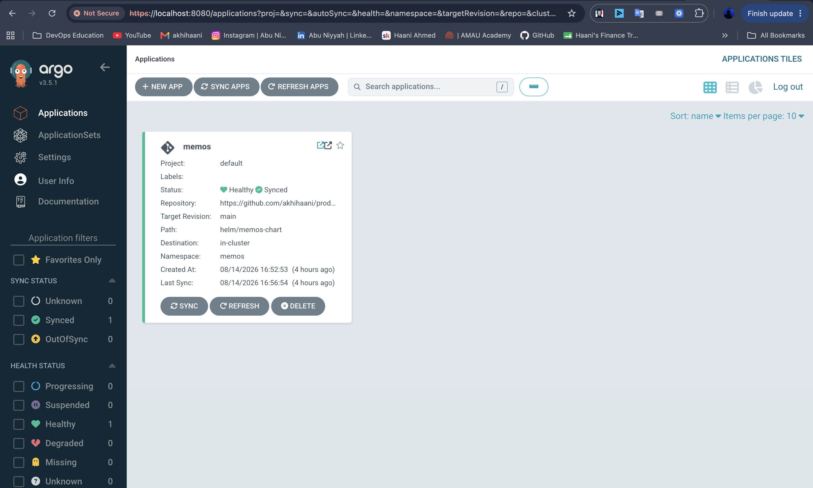

**Grafana: NGINX ingress dashboard**


</details>

<details>
<summary><b>Security &amp; access</b></summary>

**Valid TLS certificate (browser)**


**GitHub Actions variables: no static AWS keys (OIDC)**


</details>

<details>
<summary><b>Application</b></summary>

**Live memos app at the domain**


</details>

## Security

- **Keyless CI via OIDC, with an immutable subject**: GitHub Actions assumes `memos_github_role` through the GitHub OIDC provider; no static AWS keys are stored. The trust policy pins GitHub's *immutable* subject claim, `repo:<owner>@<owner_id>/<repo>@<repo_id>:ref:refs/heads/main`, which encodes the numeric owner and repo IDs, so it stays bound to this exact repository across renames and can't be hijacked by namespace recycling. Audience is `sts.amazonaws.com`, and only the `main` branch can assume the role.
- **Least-privilege IAM**: the CI role uses a tight, hand-written policy (`github-tight-policy.json.tftpl`), not `AdministratorAccess`.
- **IRSA for in-cluster controllers**: cert-manager, ExternalDNS, External Secrets Operator, and ArgoCD Image Updater each receive AWS permissions via IAM Roles for Service Accounts, scoped to exactly what each needs (a specific Route 53 hosted zone, one Secrets Manager secret, or read on one ECR repository). Pods, not nodes, hold narrowly-scoped credentials.
- **Managed database security**: the RDS Postgres database runs in private subnets, reachable only from the cluster's security group, encrypted at rest with a customer-managed KMS key, and with TLS enforced in transit. Its master password is generated and held by RDS in AWS Secrets Manager, so it never appears in Terraform code or state.
- **Secrets kept out of git**: External Secrets Operator syncs the database credentials from Secrets Manager into a Kubernetes secret at runtime, so no credentials are committed anywhere.
- **Pre-commit secret scanning**: a gitleaks pre-commit hook blocks secrets before they can enter git history, backing up the CI-side scans.
- **Protected main branch + pinned Actions**: `main` requires a pull request to change, and third-party GitHub Actions are pinned to commit SHAs rather than moving tags.
- **Encrypted, locked remote state**: the S3 backend uses server-side encryption (AES256), bucket versioning, a full public-access block, and native S3 lockfile locking (`use_lockfile`).
- **Supply-chain-aware image scanning**: ECR basic scanning on push (`scan_on_push`) plus a Trivy scan that **gates** the build on CRITICAL/HIGH findings; the Trivy action is pinned to a commit SHA (not a moving tag) to reduce action-supply-chain risk.
- **IaC scanning**: Checkov runs over the Terraform in CI, surfacing misconfigurations (soft-fail, so it reports without blocking).
- **Hardened container image**: multi-stage build, base images pinned by digest, a static CGO-disabled binary with debug symbols stripped, run as a non-root user with the binary set to `550` (read + execute, no write).
- **Network boundaries**: worker nodes sit in private subnets (egress via NAT only); cluster and load-balancer security groups are auto-scoped, and the EKS control-plane ENIs live inside the VPC.
- **TLS on all public endpoints**: HTTPS via cert-manager + Let's Encrypt (DNS-01 through Route 53), terminated at the NGINX ingress, which redirects HTTP → HTTPS by default when a TLS host is configured.

## Challenges

- **Orphaned load balancer blocking teardown**: The NGINX ingress is installed via the Helm CLI in `cluster.yaml`, so the AWS load balancer it creates is not tracked in Terraform state. On destroy the cluster was torn down first, leaving the ELB and its ENIs still holding the subnets, so VPC/subnet deletion failed with repeated subnet `AuthFailure` errors. Fixed by adding an explicit "remove the ingress" step *before* `terragrunt destroy`, and making that step concrete rather than "skip if no cluster is found" (which could silently skip while the cluster existed but was merely unreachable). Manual cleanup also had to be **region-scoped**: earlier `aws elb` deletes weren't scoped to `eu-west-2`, so the load balancers quietly survived.
- **Stale DNS record at the zone apex**: After several rebuilds, `memos.abuniyyah.uk` returned NXDOMAIN while `grafana` resolved. Its Route 53 A record was an ALIAS (health-evaluated) to an ELB from a prior cluster that no longer existed, so Route 53 returned no address. Root cause: the app is served at the **hosted-zone apex** (`memos.abuniyyah.uk` *is* the zone), and ExternalDNS's ownership-tracking TXT for an apex record (`a-memos.abuniyyah.uk`) falls *outside* the zone it manages, so ExternalDNS can never own the apex record and won't repair it when the ELB changes. Deleting the stale A/AAAA let ExternalDNS recreate them against the live ELB (immediate fix); the durable fix keeps the apex but makes it ownable, using `txtPrefix: "%{record_type}-."` (note the trailing period) puts the owner TXT *in-zone* as `a-.memos.abuniyyah.uk`, plus `policy: sync` to prune owned orphans.
- **AWS API throttling during provisioning**: Parallel Terragrunt applies fired too many AWS API calls at once, surfacing as intermittent `AuthFailure` / subnet-creation errors that looked like a credentials problem. Resolved by pinning `-parallelism=1` on the `terragrunt run --all apply` / `destroy` steps.
- **Terragrunt cross-unit dependency vs. mock outputs**: `eks-addons` depended on another unit's outputs, but `apply` wasn't an allowed command for mock outputs, so the unit kept consuming mock values and failing. Removed the dependency (it was outside the infra unit's scope) and instead resolved the Route 53 zone with a `data` source keyed off the `domain` variable.
- **IRSA / OIDC issuer condition key**: The IAM trust condition for IRSA uses the issuer *host* (`oidc.eks.eu-west-2.amazonaws.com/id/…`), not the full URL. The `replace(issuer, "https://", "")` is easy to forget, and without it the role silently never matches, and the pod's credentials just don't work, with no obvious error.
- **Migrating state locking to S3-native**: Swapped the DynamoDB lock table for S3-native locking (`use_lockfile = true`), which required bumping the AWS provider (1.1.9 → 1.11+), then deleting the DynamoDB table and dropping its IAM permissions from the CI policy.
- **A diagram cell id that broke the editor**: A drawio cell with `id="push"` made the VS Code Draw.io extension throw `d.setId is not a function` on load. `push` collides with `Array.prototype.push`, so the decoder's id-lookup returned the native function instead of a cell. Found by bisecting the file down to the single offending cell, then fixed by renaming the id.
